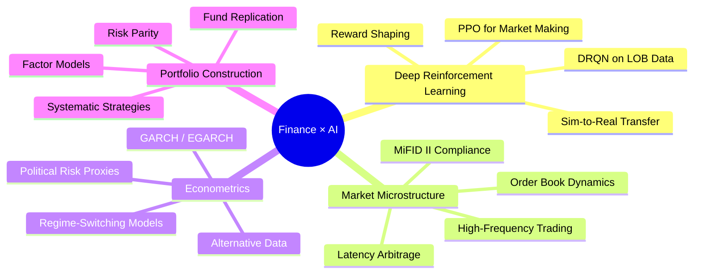

<!-- Header Banner -->
<div align="center">

  <!-- Typing SVG -->
  <a href="https://git.io/typing-svg"></a>
  <!-- Subtitle badges -->
  
  &nbsp;
  <br/>
  

  <!-- Social links -->
  [](https://www.linkedin.com/in/ben-pfeffer/)
  [](mailto:benpfefferpro@gmail.com)
  [](https://github.com/BenPfeffer-bot)
</div>


<div align="center">

<!-- ── Programming Languages ── -->

                   
              
             

</div>

<!-- Divider -->


## About Me

```python
class BenPfeffer:
    """Specialized in Market Finance × Machine Learning"""
    
    def __init__(self):
        self.role       = "MIM Finance Student"
        self.school     = "ESCP Business School — Master Grande École"
        self.major      = "Market Finance (Finance de Marché)"
        self.company    = "CACIB / Icona Capital / CenturaFX / WarburgAI"
        self.thesis     = "Deep Reinforcement Learning in High-Frequency Trading"
        self.location   = "Paris, France"
        self.languages  = ["French (native)", "English (fluent)", "Spanish (B1)", "Italian (A2)"]
    
    def current_focus(self):
        return [
            "🧠 DRL architectures (PPO, DRQN) for order book trading",
            "📈 Quantitative strategies & factor-based portfolio construction",
            "🏦 Fixed Income — EGB, SSA, Inflation, Repo markets",
            "📊 Financial econometrics (GARCH, regime-switching models)",
        ]
    
    def looking_for(self):
        return "End-of-studies internship in Trading / Sales in rates or in fixed income"
```
<!-- Divider -->


## My main projects
 
<table>
<tr>
<td width="50%" valign="top">
 
### [Volatility Clustering RL Execution](https://github.com/BenPfeffer-bot/volatility-clustering-rl-execution)
**Reinforcement Learning for optimal trade execution**
 
RL-driven execution engine that detects volatility clustering regimes and adapts order placement strategies in real-time. Combines GARCH-based regime detection with deep RL agents for intelligent execution under varying market microstructure conditions.
 
`Python` `PyTorch` `Reinforcement Learning` `GARCH` `Execution`
 
 
 
</td>
<td width="50%" valign="top">
 
###  [Regime-Based Quantitative Approach](https://github.com/BenPfeffer-bot/Regime_Based_Quantitative_Approach)
**Regime-switching models for systematic trading**
 
Systematic trading framework that identifies market regimes (trending, mean-reverting, volatile) using hidden Markov models and adapts portfolio allocation and signal generation dynamically across asset classes.
 
`Python` `HMM` `Regime Detection` `Systematic Trading` `Portfolio`
 
 
 
</td>
</tr>
<tr>
<td width="50%" valign="top">
 
### [Multi-Factor Volatility-Driven Liquidity Arbitrage](https://github.com/BenPfeffer-bot/multi-factor-volatility-driven-liquidity-arbitrage)
**Cross-asset liquidity premium extraction**
 
Multi-factor model exploiting volatility-driven dislocations in liquidity across markets. Combines implied/realized vol spreads, order flow imbalance, and cross-asset correlations to identify and harvest liquidity arbitrage opportunities.
 
`Jupyter Notebook` `Factor Models` `Volatility` `Arbitrage` `Liquidity`
 
 
 
</td>
<td width="50%" valign="top">
 
### 🔬 [Experiment Strategies](https://github.com/BenPfeffer-bot/experiment-strategies)
**Quantitative strategy backtesting lab**
 
Experimental sandbox for prototyping, testing, and comparing quantitative trading strategies — from momentum and mean-reversion to machine-learning-based signals. Includes performance analytics, risk metrics, and walk-forward optimization.
 
`Python` `Backtesting` `Strategy Design` `Risk Analytics`
 
 
 
</td>
</tr>
<tr>
<td width="50%" valign="top">
 
###  [Finance Tools](https://github.com/BenPfeffer-bot/finance-tools)
**Comprehensive financial analysis toolkit**
 
Full-stack financial analysis tool performing both technical and fundamental analysis of major companies. Interactive dashboards, automated screening, valuation models, and charting for data-driven investment decisions.
 
`Jupyter Notebook` `Technical Analysis` `Fundamental Analysis` `Dashboards`
 
 
 
</td>
<td width="50%" valign="top">
 
### [DRL in HFT — Master Thesis](https://github.com/BenPfeffer-bot)
**Deep Reinforcement Learning for High-Frequency Trading**
 
Master thesis codebase benchmarking PPO vs DRQN architectures for high-frequency market making on limit order book (LOB) microstructure data. Includes MiFID II regulatory compliance framework and sim-to-real transfer experiments.
 
`Python` `PyTorch` `Deep RL` `LOB Data` `MiFID II`
 
 
 
</td>
</tr>
</table>
<br/>
<!-- Divider -->


## 🧭 Research Interests

<div align="center">



</div>

<br/>

<!-- Divider -->


## 📬 Let's Connect

<div align="center">

I'm always open to discussing **quantitative research**, **trading strategies**, or **DRL applications in finance**.

If you're working on something at the intersection of **markets and machine learning** — let's talk.

<br/>

[](https://linkedin.com/in/benpfeffer)
&nbsp;&nbsp;
[](mailto:ben.pfeffer@edu.escp.eu)

<br/>
<br/>


</div>
