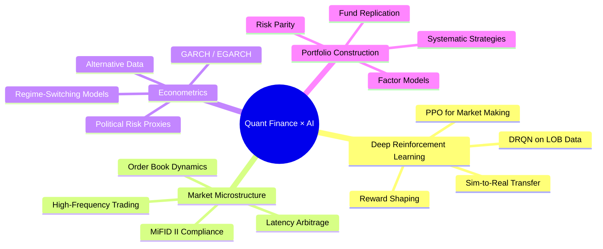

<!-- Header Banner -->
<div align="center">

  <!-- Typing SVG -->
  <a href="https://git.io/typing-svg"></a>
  <!-- Subtitle badges -->
  
  &nbsp;
  <br/>
  

  <!-- Social links -->
  [](https://linkedin.com/in/benpfeffer)
  [](mailto:ben.pfeffer@edu.escp.eu)
  [](https://github.com/benpfeffer)
</div>

<!-- Divider -->


## About Me

```python
class BenPfeffer:
    """Specialized in Market Finance × Machine Learning"""
    
    def __init__(self):
        self.role       = "MIM Finance Student"
        self.school     = "ESCP Business School — Master Grande École"
        self.major      = "Market Finance (Finance de Marché)"
        self.company    = "Co-Founder @ Warburg.AI"
        self.thesis     = "Deep Reinforcement Learning in High-Frequency Trading"
        self.location   = "Paris, France"
        self.languages  = ["French (native)", "English (fluent)", "Spanish (B1)", "Italian (A2)"]
    
    def current_focus(self):
        return [
            "🧠 DRL architectures (PPO, DRQN) for order book trading",
            "📈 Quantitative strategies & factor-based portfolio construction",
            "🏦 Fixed Income — EGB, SSA, Inflation, Repo markets",
            "📊 Financial econometrics (GARCH, regime-switching models)",
        ]
    
    def looking_for(self):
        return "End-of-studies internship in Trading / Sales in rates or in fixed income"
```
<!-- Divider -->


## What I learn

<div align="center">

<!-- ── Programming Languages ── -->

                   
              
             

</div>

<!-- Divider -->


## 🚀 Featured Projects

<table>
<tr>
<td width="50%" valign="top">

### 🧠 [Warburg.AI](https://github.com/benpfeffer/warburg-ai)
**Quantitative Trading Engine powered by Deep RL**

Autonomous trading system that uses PPO and DRQN algorithms on Level-2 order book data for high-frequency alpha generation — from data pipeline to live execution.

`Python` `PyTorch` `Stable-Baselines3` `Order Book` `HFT`

 

</td>
<td width="50%" valign="top">

### 📊 [OAT-Bund Spread Analysis](https://github.com/benpfeffer/oat-bund-spread)
**Econometric modelling with alternative data**

GARCH/EGARCH analysis of sovereign spread dynamics using Google Trends as a real-time proxy for political risk. Regime-switching detection and volatility clustering.

`Python` `R` `GARCH` `Google Trends` `Econometrics`

 

</td>
</tr>
<tr>
<td width="50%" valign="top">

### 🏦 [Hedge Fund Replicator](https://github.com/benpfeffer/hedge-fund-clone)
**Factor-based fund return cloning**

Replication of Aberdeen fund performance via multi-factor regression, ANOVA diagnostics, residual analysis (statsmodels), and feature engineering for systematic portfolio construction.

`Python` `statsmodels` `Regression` `Factor Models` `SQL`

 

</td>
<td width="50%" valign="top">

### ⚡ [DRL in HFT — Thesis](https://github.com/benpfeffer/drl-hft-thesis)
**Master thesis research codebase**

Benchmarking Deep Reinforcement Learning architectures (PPO vs DRQN) for high-frequency market making on LOB microstructure data. Includes MiFID II compliance framework.

`Python` `PyTorch` `Deep RL` `LOB Data` `MiFID II`

 

</td>
</tr>
<tr>
<td width="50%" valign="top">

### 💹 [Options Strategy Visualiser](https://github.com/benpfeffer/options-visualiser)
**Interactive P&L payoff diagrams**

Web-based tool for building and visualizing multi-leg options strategies — straddles, strangles, tunnels, covered calls — with real-time Greeks computation and interactive Chart.js payoff curves.

`JavaScript` `Chart.js` `HTML/CSS` `Options Pricing`

 

</td>
<td width="50%" valign="top">

### 📐 [Fixed Income Toolkit](https://github.com/benpfeffer/fixed-income-toolkit)
**Derivatives pricing & analytics**

Pricing library for swaptions, caplets, CMS instruments, LIBOR-in-arrears adjustments, and convexity corrections. Built during FC01 coursework (Prof. Kahalé).

`Python` `QuantLib` `Black-76` `Numéraire Change`

 

</td>
</tr>
</table>

<br/>

<!-- Divider -->


## 📈 GitHub Analytics

<div align="center">
  
  &nbsp;&nbsp;
  
</div>

<br/>

<div align="center">
  
</div>

<br/>

<!-- Activity graph -->
<div align="center">
  
</div>

<br/>

<!-- Divider -->


## 🎓 Experience & Education

```
┌─────────────────────────────────────────────────────────────────────┐
│  💼  PROFESSIONAL EXPERIENCE                                        │
├─────────────────────────────────────────────────────────────────────┤
│                                                                     │
│  🏛️  Crédit Agricole CIB — Trading Floor Analyst                    │
│     SSA / EGB / Inflation Desk                                      │
│     → Sovereign bond trading, auction analysis, relative value      │
│     → Bloomberg workflow, pricing models, risk monitoring            │
│                                                                     │
│  🏦  Family Office — Investment Analyst (London)                    │
│     → Portfolio analytics, asset allocation, client reporting       │
│                                                                     │
│  🤖  Warburg.AI — Co-Founder & Quant Developer                     │
│     → DRL-based trading engine, full-stack infrastructure           │
│                                                                     │
├─────────────────────────────────────────────────────────────────────┤
│  🎓  EDUCATION                                                      │
├─────────────────────────────────────────────────────────────────────┤
│                                                                     │
│  🏫  ESCP Business School — Master Grande École                     │
│     Specialisation: Finance de Marché (Market Finance)              │
│     Thesis: Deep Reinforcement Learning in HFT                      │
│                                                                     │
└─────────────────────────────────────────────────────────────────────┘
```

<br/>

<!-- Divider -->


## 🧭 Research Interests

<div align="center">



</div>

<br/>

<!-- Divider -->


## 📬 Let's Connect

<div align="center">

I'm always open to discussing **quantitative research**, **trading strategies**, or **DRL applications in finance**.

If you're working on something at the intersection of **markets and machine learning** — let's talk.

<br/>

[](https://linkedin.com/in/benpfeffer)
&nbsp;&nbsp;
[](mailto:ben.pfeffer@edu.escp.eu)

<br/>
<br/>


</div>
